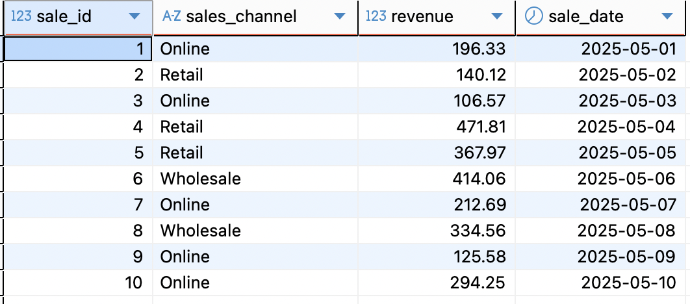
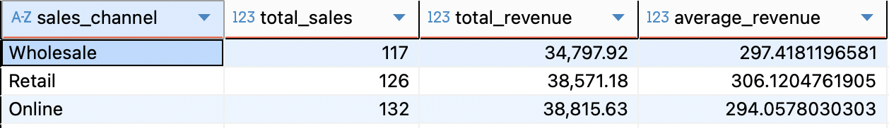

# DBT Test Project

## Introduction
This project aims to practice using the dbt tool.  
The project is inspired by the [Jaffle Shop](https://github.com/dbt-labs/jaffle-shop).

Simulated data example:



---

## Implementation

Firstly, create a virtual environment and install the required packages for the project. Then, simulate the needed data (a small dataset for testing).

Secondly, create a `docker-compose.yml` file to start a PostgreSQL container for storing data.

Thirdly, use the command `dbt init mall` to initialize a dbt project, where `mall` is the project name (you can rename it).

After initialization, dbt will generate folders and files such as `models`, `seeds`, `target`, etc.

Fourthly, create `sales_analysis.sql` and `schema.yml` inside the `models` folder. These files are used to transform the simulated data and validate the schema. Before running them, move the simulated dataset files into the `seeds` folder.

Finally, run the following commands:

```bash
dbt debug
dbt seed
dbt run
dbt test
```

- `dbt debug`: checks the dbt configuration and database connection.
- `dbt seed`: loads the simulated datasets from the `seeds` folder into PostgreSQL tables.
- `dbt run`: runs the transformation models (in this project, `sales_analysis.sql`).
- `dbt test`: validates the schema and data quality based on `schema.yml`.

---

## Result

The final result is a transformed view/table in PostgreSQL like below:

